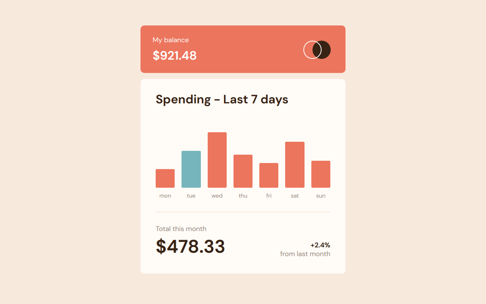

# Frontend Mentor - Expenses chart component solution

This is a solution to the [Expenses chart component challenge on Frontend Mentor](https://www.frontendmentor.io/challenges/expenses-chart-component-e7yJBUdjwt). Frontend Mentor challenges help you improve your coding skills by building realistic projects.

## Table of contents

- [Overview](#overview)
  - [The challenge](#the-challenge)
  - [Screenshot](#screenshot)
  - [Links](#links)
- [My process](#my-process)
  - [Built with](#built-with)
  - [What I learned](#what-i-learned)
  - [Continued development](#continued-development)
  - [Useful resources](#useful-resources)
- [Author](#author)

## Overview

### The challenge

Users should be able to:

- View the bar chart and hover over the individual bars to see the correct amounts for each day
- See the current day’s bar highlighted in a different colour to the other bars
- View the optimal layout for the content depending on their device’s screen size
- See hover states for all interactive elements on the page
- **Bonus**: Use the JSON data file provided to dynamically size the bars on the chart

### Screenshot

### Links

- Solution URL: [https://www.frontendmentor.io/solutions/expenses-chart-component-using-react-and-scss-nDdVoh8DLy](https://www.frontendmentor.io/solutions/expenses-chart-component-using-react-and-scss-nDdVoh8DLy)
- Live Site URL: [https://expenses-chart-component-wheat.vercel.app/](https://expenses-chart-component-wheat.vercel.app/)

## My process

### Built with

- Semantic HTML5 markup
- SCSS
- Flexbox
- CSS Grid
- Mobile-first workflow
- [React](https://reactjs.org/) - JS library

### What I learned

- I tried using more the Sass @use rule for the typography's mixins.
- I used react inline styling for dynamically rendering the bar graphs.
- I used the CSS adjacent sibling combinator for the dollar amount that hovers over the bar.

### Continued development

I think it is very interesting to encounter this kind of challenges. I was not sure how to to the graph. I want to keep getting into this kind of situations that force me to find solutions.

### Useful resources

- [@use](https://sass-lang.com/documentation/at-rules/use) - The Sass documentation for @use. It was cool to use it with the typography.
- [DOM Elementes](https://reactjs.org/docs/dom-elements.html#style) - React documentation where you can find inline styling examples.
- [Date.prototype.getDay()](https://developer.mozilla.org/en-US/docs/Web/JavaScript/Reference/Global_Objects/Date/getDay) - The Date method that allowed me to highlight the day of the week on the graph.

## Author

- Frontend Mentor - [@miguelzaga](https://www.frontendmentor.io/profile/miguelzaga)
